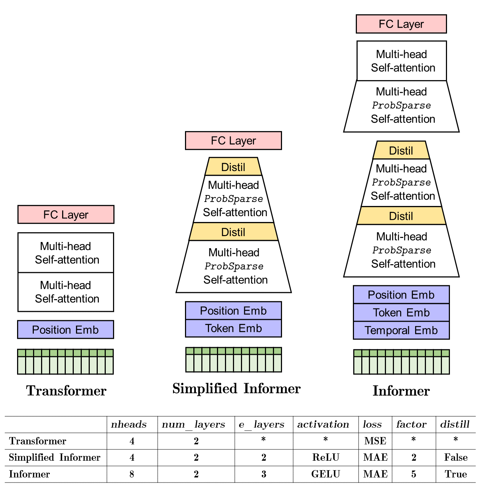

# [HelloQlib](https://github.com/mczhuge/HelloQlib)


## Introduction
I'm interested in program-based quantitative investing for a while. 
This is a project that I tried out with the **[Qlib](https://github.com/microsoft/qlib)** library, and it performs stock prediction experiments.
The goal is to make a model that is better than the standard transformer and its variants.
I made some attempts inspired by **[Informer](https://github.com/zhouhaoyi/Informer2020)** that is popular to model long sequences. So I called the model "Simplified Informer". I use MAE loss to train the model. 

## Install
* Create a conda container.
    ```bash
    conda create -n qlib_env python=3.7
    conda activate qlib_env
    pip install numpy
    pip install --upgrade  cython   
    conda install pytorch    
    ```
* Clone the repository and install ``Qlib`` as follows.
    ```bash
    git clone git@github.com:mczhuge/HelloQlib.git && cd HelloQlib/qlib
    pip install .
    ```

* Load and prepare data by running the following code:
  ```bash
  # get 1d data
  python scripts/get_data.py qlib_data --target_dir ~/.qlib/qlib_data/cn_data --region cn
  # get 1min data
  python scripts/get_data.py qlib_data --target_dir ~/.qlib/qlib_data/cn_data_1min --region cn --interval 1min
  ```

As mentioned in Qlib, this dataset is created by public data collected by [crawler scripts](scripts/data_collector/), which have been released in
the same repository.

## Simplified Informer
 

## Experiments
Qlib provides a tool named `qrun` to run the whole workflow automatically (including building dataset, training models, backtest and evaluation). You can start an auto quant research workflow and have a graphical reports analysis according to the following steps: 

1. Quant Research Workflow: Run  `qrun` with lightgbm workflow config ([workflow_config_informer_Alpha158.yaml](qlib/examples/benchmarks/Informer/workflow_config_informer_Alpha158.yaml) as following.
    ```bash
      cd examples  # Avoid running program under the directory contains `qlib`
      qrun benchmarks/Informer/workflow_config_informer_Alpha158.yaml
    ```
    The result of `qrun` is as follows, please refer to [Intraday Trading](https://qlib.readthedocs.io/en/latest/) for more details about the result. 

    ```bash
    'The following are analysis results of the excess return without cost(1day).'
                       risk
    mean               0.000489
    std                0.004326
    annualized_return  0.116330
    information_ratio  1.743127
    max_drawdown      -0.079772
    'The following are analysis results of the excess return with cost(1day).'
                         risk
    mean               0.000303
    std                0.004325
    annualized_return  0.072150
    information_ratio  1.081228
    max_drawdown      -0.088342
    ```
    Here are detailed documents for `qrun` and [workflow](https://qlib.readthedocs.io/en/latest/component/workflow.html).

## Comparisons on Alpha158 dataset (excess return with cost)
:triangular_flag_on_post: denotes top-2 solutions.

| Model Name                               | Dataset                             |Training Time |  Annualized Return | Information Ratio | Max Drawdown |
|------------------------------------------|-------------------------------------|-------------------|-------------------|-------------------|--------------|
| LSTM(Sepp Hochreiter, et al.)            | Alpha158(with selected 20 features) | 2m49s |  0.035872       | 0.553567       |  -0.118607 |
| Transformer(Ashish Vaswani, et al.)      | Alpha158                            | 9m27s | 0.061941       | 0.923842       | -0.097422 |
| Localformer(Juyong Jiang, et al.)        | Alpha158                            | 9m11s| 0.012461       | 0.201438       | -0.102535 |
| GATs (Petar Velickovic, et al.)          | Alpha158(with selected 20 features) | 11m52s | 0.057336       | 0.828178       | **-0.063197:triangular_flag_on_post:**|
| LightGBM(Guolin Ke, et al.)              | Alpha158                            | 14s | **0.091711:triangular_flag_on_post:**      | **1.034353:triangular_flag_on_post:**      | -0.103803 |
| Simplified Informer (modified from  Haoyi Zhou, et al.)  | Alpha158            | 4m39s |  **0.072150 :triangular_flag_on_post:**     | **1.081228:triangular_flag_on_post:**     | **-0.088342:triangular_flag_on_post:** |

## Licence
This is a quick play (and development) built upon Qlib. The right belongs to **[Qlib](https://github.com/microsoft/qlib)**：

This project has adopted the [Microsoft Open Source Code of Conduct](https://opensource.microsoft.com/codeofconduct/).
For more information see the [Code of Conduct FAQ](https://opensource.microsoft.com/codeofconduct/faq/) or
contact [opencode@microsoft.com](mailto:opencode@microsoft.com) with any additional questions or comments.
